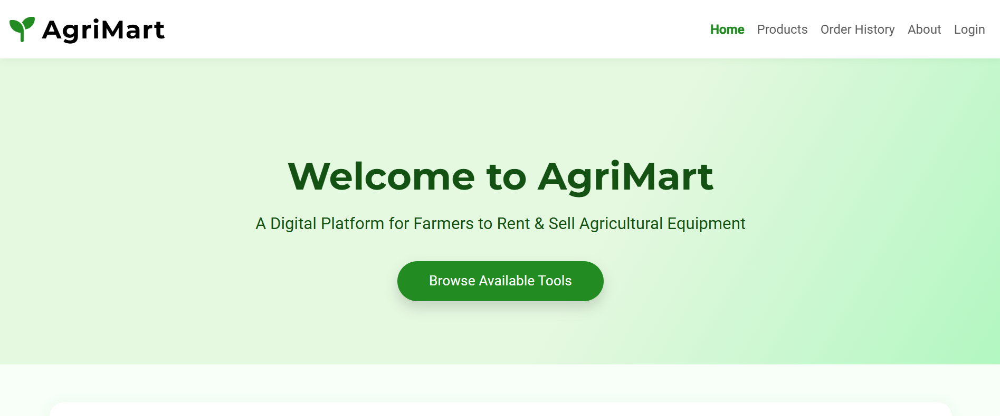
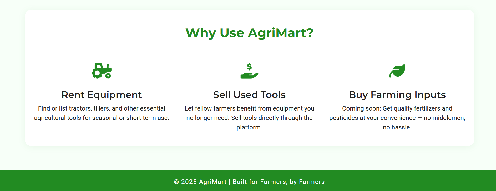
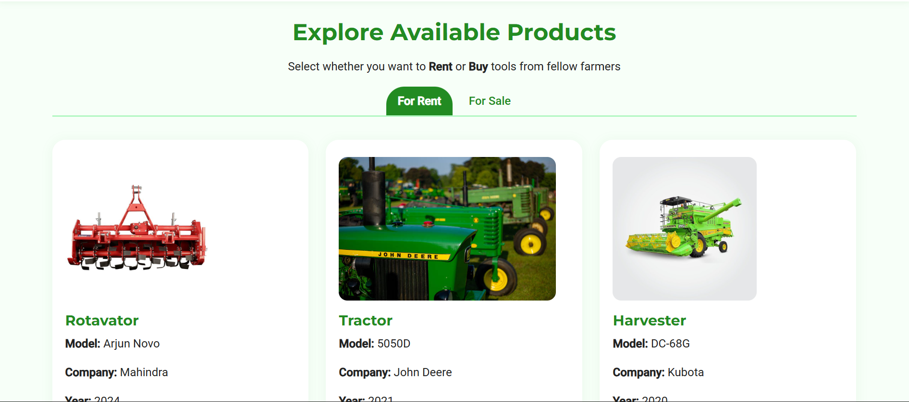
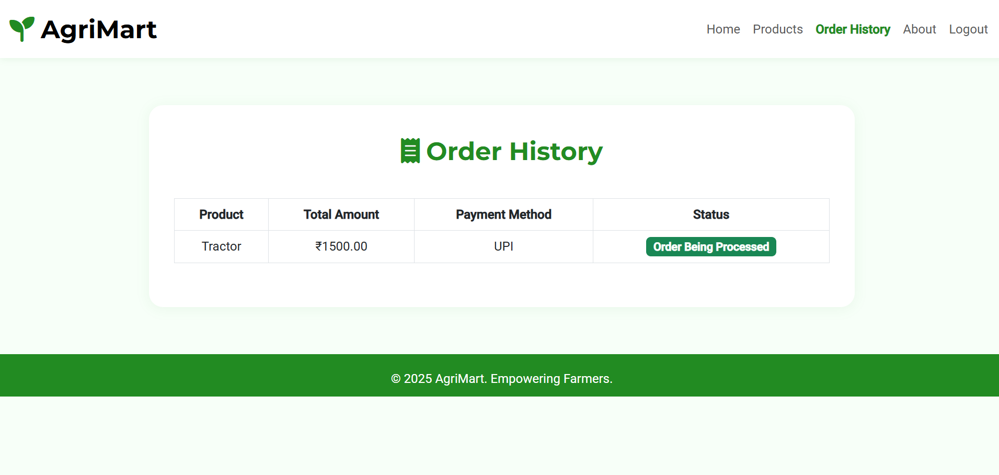
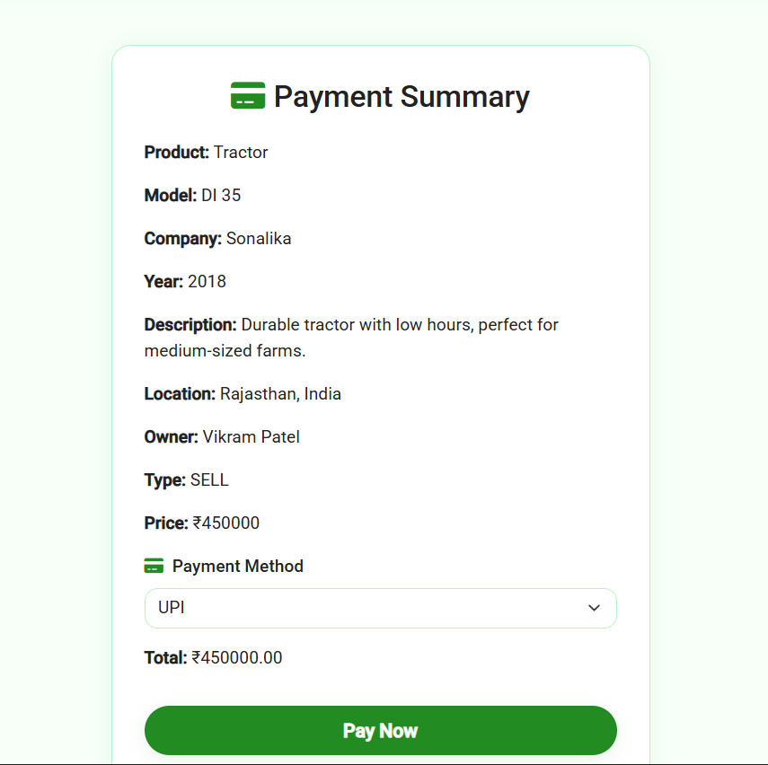
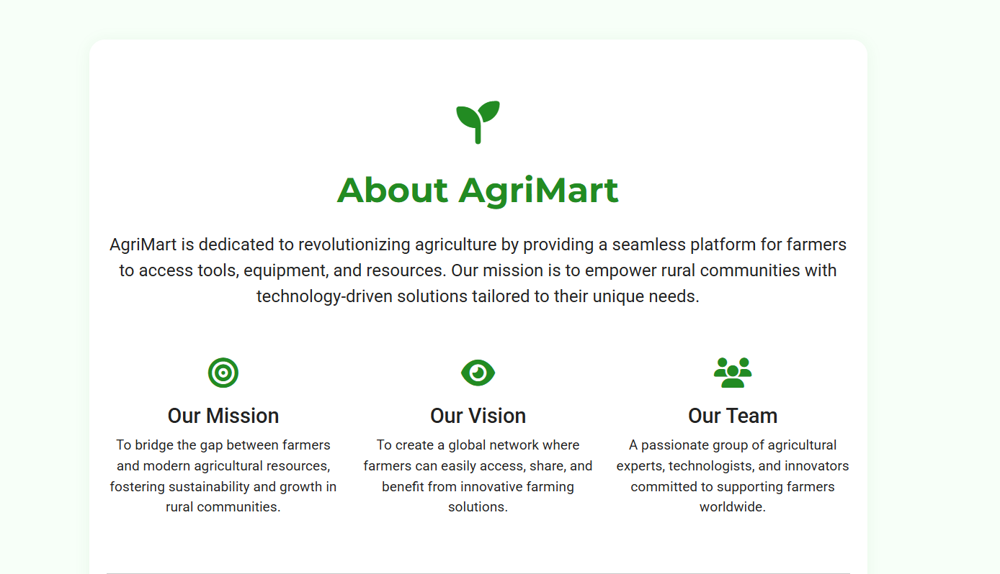

# Agri-Mart

## Overview
AgriMart is a digital platform designed to empower farmers by facilitating the rental and sale of agricultural equipment. Built as a full-stack web application using **Spring Boot**, **PostgreSQL**, and **Thymeleaf**, it connects farmers directly, eliminating middlemen and promoting sustainable farming practices.  

Users can list equipment for rent or sale, browse available products, process payments via UPI, and review order history. This project showcases skills in backend development, database management, version control, and frontend design.

---

## Features
- **User Authentication:** Secure login and registration for farmers and buyers.
- **Product Listing:** Farmers can list equipment with details like product name, model, company, year, description, location, and images.
- **Product Browsing:** Search and filter products by type (rent/sale) with visual previews.
- **Payment Integration:** UPI payment support with a summary page and "Pay Now" functionality.
- **Order History:** View past orders with status updates (e.g., "Order Being Processed").
- **Responsive Design:** Mobile-friendly interface using HTML and CSS.

---
Home Pages:  

## Technologies Used
- **Backend:** Spring Boot (RESTful APIs, controllers, services, security)
- **Database:** PostgreSQL (users, products, orders, payments)
- **Build Tool:** Maven
- **Version Control:** Git & GitHub
- **Frontend:** Thymeleaf, HTML5, CSS3
- **Programming Paradigm:** Java OOP (encapsulation, inheritance, polymorphism)

---

## Project Structure


---

## Development Process

1. **Project Initialization**  
   - Created using [Spring Initializr](https://start.spring.io) with dependencies: Spring Web, Spring Data JPA, Spring Security, Thymeleaf, PostgreSQL Driver, Lombok, DevTools.  
   - Imported into IntelliJ IDEA.

2. **Database Setup**  
   - PostgreSQL database `agrimart` created locally.  
   - Configured connection in `application.properties`.  
   - **Database Commands:**
     ```sql
     -- Create database
     CREATE DATABASE agrimart;

     -- Connect to database
     \c agrimart

     -- Create users table (example)
     CREATE TABLE users (
         id SERIAL PRIMARY KEY,
         username VARCHAR(50) UNIQUE NOT NULL,
         password VARCHAR(100) NOT NULL,
         email VARCHAR(100) UNIQUE NOT NULL
     );

     -- Create products table (example)
     CREATE TABLE products (
         id SERIAL PRIMARY KEY,
         name VARCHAR(100) NOT NULL,
         type VARCHAR(10) CHECK (type IN ('rent', 'sale')),
         description TEXT,
         location VARCHAR(100),
         image_url VARCHAR(255)
     );


##Core Implementation

Models: Defined JPA entities in Model/.
Repositories: JpaRepository interfaces in Repo/.
Services: Business logic in Service/.
Controllers: RESTful endpoints in Controller/.


##Configuration

CORS settings in Config/CorsConfig.java.
Security setup in Security/.


##Frontend Development

Dynamic templates using Thymeleaf (templates/).
Styled with CSS (static/) with green-themed buttons and cards.
Forms for listing equipment and payments.


##Static Resources & Images

Stored in static/Uploads and githubimages/.
Implemented image upload and serving functionality.


##Version Control

Git repository initialized.
Code pushed to GitHub repository AgriMart.


##Testing & Debugging

Unit and integration tests in test/.
Debugging via IntelliJ IDEA.


##Running the Application

Run BackendApplication class in IntelliJ IDEA.
Access at http://localhost:8080.


##Screenshots
Products Page: 
Order History: 
Listing Form: 
Payment Summary: 
About Page: 


##Setup and Installation
bash# Clone the repository
git clone https://github.com/yourusername/AgriMart.git
cd AgriMart/Backend

# Ensure PostgreSQL is installed and 'agrimart' database is created
# Update application.properties with DB credentials

# Open in IntelliJ IDEA, resolve Maven dependencies
# Run the application
Access the app at http://localhost:<your-port>.


##Contributing
Contributions are welcome! Please fork the repository and submit a pull request. For major changes, open an issue first to discuss.

##Contact
For questions or feedback, reach out via GitHub issues or email at sadhanalavenkat372@gmail.com.


