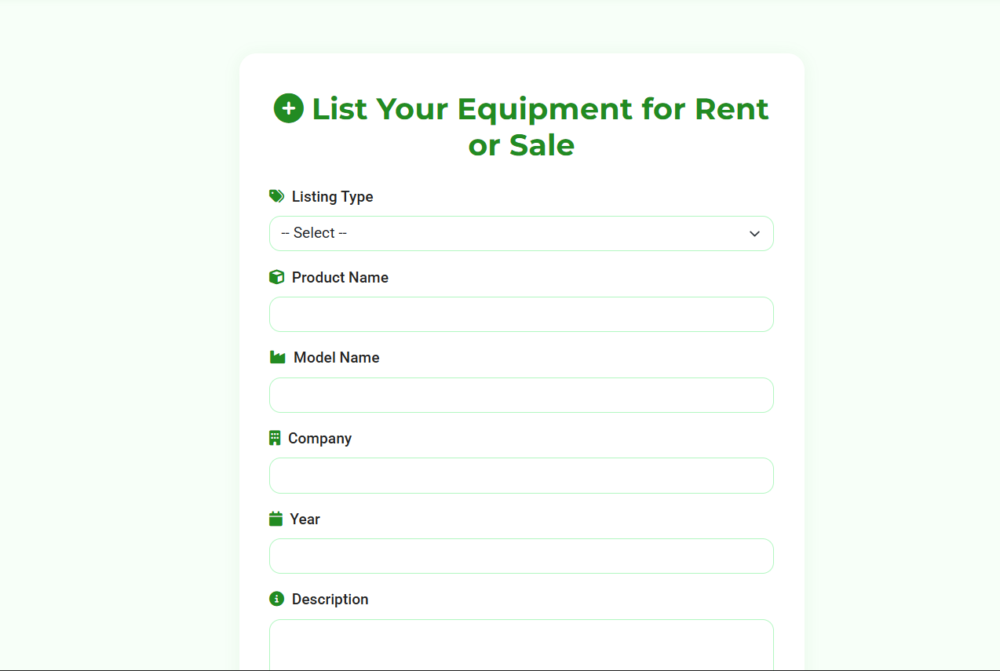

# AgriMart

## Overview
AgriMart is a full-stack web application designed to empower farmers by enabling the rental and sale of agricultural equipment. Built with **Spring Boot**, **PostgreSQL**, and **Thymeleaf**, AgriMart connects farmers directly, eliminating intermediaries and promoting sustainable farming practices. Users can list equipment for rent or sale, browse products, process payments via UPI, and review order history. This project demonstrates proficiency in backend development, database management, version control, and responsive frontend design.

## Features
- **User Authentication**: Secure login and registration system for farmers and buyers.
- **Product Listing**: Farmers can create detailed equipment listings, including name, model, company, year, description, location, and images.
- **Product Browsing**: Search and filter equipment by type (rent or sale) with visual previews.
- **Payment Integration**: Seamless UPI payment processing with a summary page and "Pay Now" functionality.
- **Order History**: View past orders with real-time status updates (e.g., "Order Being Processed").
- **Responsive Design**: Mobile-friendly interface built with HTML5, CSS3, and Thymeleaf.

## Screenshots
| Home Page | Products Page | Order History | Listing Form | Payment Summary | About Page |
|-----------|---------------|---------------|--------------|----------------|------------|
|  |  |  |  |  |  |

## Technologies Used
- **Backend**: Spring Boot (RESTful APIs, controllers, services, security)
- **Database**: PostgreSQL (managing users, products, orders, and payments)
- **Frontend**: Thymeleaf, HTML5, CSS3
- **Build Tool**: Maven
- **Version Control**: Git & GitHub
- **Programming Paradigm**: Java Object-Oriented Programming (encapsulation, inheritance, polymorphism)

## Project Structure


## Development Process

### 1. Project Initialization
- Initialized using [Spring Initializr](https://start.spring.io) with dependencies:
  - Spring Web
  - Spring Data JPA
  - Spring Security
  - Thymeleaf
  - PostgreSQL Driver
  - Lombok
  - Spring Boot DevTools
- Imported into IntelliJ IDEA for development.

### 2. Database Setup
- Created a PostgreSQL database named `agrimart`.
- Configured database connection in `application.properties`.
- Example database schema:
  ```sql
  -- Create database
  CREATE DATABASE agrimart;

  -- Connect to database
  \c agrimart

  -- Users table
  CREATE TABLE users (
      id SERIAL PRIMARY KEY,
      username VARCHAR(50) UNIQUE NOT NULL,
      password VARCHAR(100) NOT NULL,
      email VARCHAR(100) UNIQUE NOT NULL
  );

  -- Products table
  CREATE TABLE products (
      id SERIAL PRIMARY KEY,
      name VARCHAR(100) NOT NULL,
      type VARCHAR(10) CHECK (type IN ('rent', 'sale')),
      description TEXT,
      location VARCHAR(100),
      image_url VARCHAR(255)
  );
  ```
  

### 3. Core Implementation
- **Models**: Defined JPA entities in `Model/`.
- **Repositories**: Created `JpaRepository` interfaces in `Repo/`.
- **Services**: Implemented business logic in `Service/`.
- **Controllers**: Built RESTful endpoints in `Controller/`.

### 4. Configuration
- **CORS**: Configured in `Config/CorsConfig.java`.
- **Security**: Set up in `Security/` for authentication and authorization.

### 5. Frontend Development
- **Templates**: Developed dynamic UI using Thymeleaf in `templates/`.
- **Styling**: Applied green-themed CSS in `static/` for buttons and cards.
- **Forms**: Created forms for equipment listing and payment processing.

### 6. Static Resources & Images
- Stored in `static/Uploads` and `githubimages/`.
- Implemented image upload and serving functionality.

### 7. Version Control
- Managed using Git and hosted on GitHub: [AgriMart Repository](https://github.com/yourusername/AgriMart).

### 8. Testing & Debugging
- Unit and integration tests located in `test/`.
- Debugged using IntelliJ IDEA's built-in tools.

### 9. Running the Application
- Open the project in IntelliJ IDEA.
- Run the `BackendApplication` class.
- Access the application at: [http://localhost:8080](http://localhost:8080).

## Setup and Installation
1. **Clone the Repository**:
   ```bash
   git clone https://github.com/yourusername/AgriMart.git
   cd AgriMart/Backend
   ```
2. **Set Up PostgreSQL**:
   - Ensure PostgreSQL is installed.
   - Create the `agrimart` database using the SQL commands above.
   - Update `application.properties` with your database credentials.
3. **Resolve Dependencies**:
   - Open the project in IntelliJ IDEA.
   - Allow Maven to resolve dependencies.
4. **Run the Application**:
   - Execute the `BackendApplication` class.
   - Access the app at [http://localhost:8080](http://localhost:8080).

## Contributing
Contributions are welcome! To contribute:
1. Fork the repository.
2. Create a new branch (`git checkout -b feature-branch`).
3. Make your changes and commit (`git commit -m 'Add feature'`).
4. Push to the branch (`git push origin feature-branch`).
5. Open a pull request.

For major changes, please open an issue first to discuss the proposed changes.

## Contact
For questions or feedback, reach out via:
- **GitHub Issues**: [AgriMart Issues](https://github.com/Ramana372/AgriMart/issues)
- **Email**: sadhanalavenkat372@gmail.com
